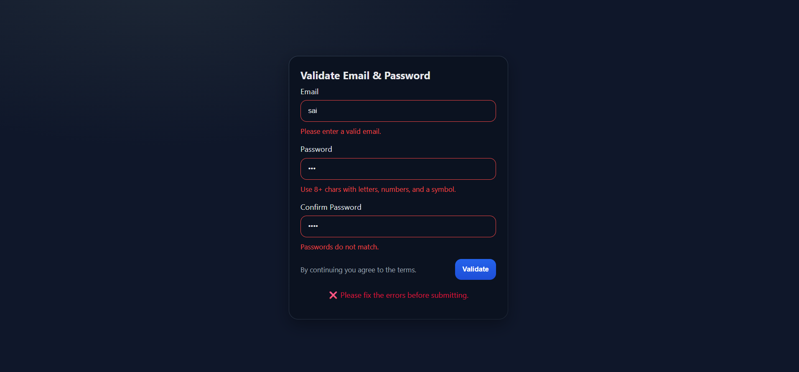

# 📧 Email & Password Validator

A simple **Email and Password Validator** built using **HTML, CSS, and JavaScript**.  
This project validates user input in real-time and ensures that the email and password follow proper rules before allowing form submission.  

---

## 🔹 Features
- ✅ **Email Validation** – Checks if the email is in a valid format.  
- ✅ **Password Validation** – Ensures password has at least:
  - 8 characters  
  - 1 letter  
  - 1 number  
  - 1 special character (@, $, !, %, etc.)  
- ✅ **Confirm Password Validation** – Confirms that the password and confirm password fields match.  
- ✅ **Live Feedback** – Shows red borders for invalid input and green borders for valid input.  
- ✅ **Form Submission Handling** – Prevents submission until all fields are valid.  

---

## 🔹 Tech Stack
- **HTML** → Page structure & form elements  
- **CSS** → Styling for valid/invalid states & messages  
- **JavaScript** → Validation logic & form handling  

---

## 🔹 How It Works
1. The user enters their email and password in the form.  
2. JavaScript checks:
   - Email format using **Regex**  
   - Password strength using **Regex**  
   - Confirm password matches the password  
3. The form gives **instant feedback** as the user types.  
4. On submit:
   - If valid → ✅ Success message is shown  
   - If invalid → ❌ Error message is displayed  

---

## 🔹 Screenshots
👉 *(Add your project screenshots here after running it in the browser)*  

---

## 🔹 Learning Outcomes
- How to **use Regex** for validation.  
- How to **handle form events** (`input`, `submit`).  
- How to **manipulate CSS classes** (`valid`, `invalid`) with JavaScript.  
- How to provide **real-time feedback** to users.  

---

## 🔹 Project Structure
## 🔹 Screenshots

